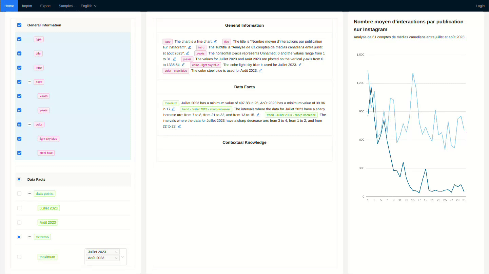

# From Graphs to Words

This project presents a research prototype of the paper *From Graphs to Words: A Computer-Assisted Framework for the Production of Accessible Text Descriptions*, which has been accepted for presentation at the IEEE VIS 2024 Short Papers session.

The framework aims to improve the accessibility of graphical data by generating interactive natural language descriptions.

## Live Demo
Explore the prototype here: [http://34.31.250.5/vis2text/](http://34.31.250.5/vis2text/)

## Article
Read the full paper on arXiv: [https://arxiv.org/abs/2409.17494](https://arxiv.org/abs/2409.17494)

## Demonstration

## Getting Started with Create React App

This project was bootstrapped with [Create React App](https://github.com/facebook/create-react-app).

## Available Scripts

In the project directory, you can run:

### `yarn start`

Runs the app in the development mode.\
Open [http://localhost:3000](http://localhost:3000) to view it in your browser.

The page will reload when you make changes.\
You may also see any lint errors in the console.